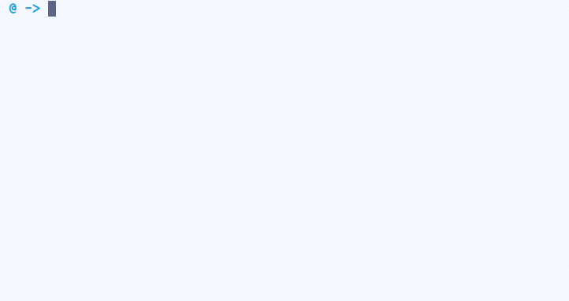

# [][website]

> A simple and extensible shell script for managing your todo.txt file.

[](https://travis-ci.org/todotxt/todo.txt-cli)
[](https://github.com/todotxt/todo.txt-cli/issues) 
[](https://github.com/todotxt/todo.txt-cli/network)
[](https://github.com/todotxt/todo.txt-cli/stargazers)
[](https://raw.githubusercontent.com/todotxt/todo.txt-cli/master/LICENSE)
[](https://gitter.im/todotxt/todo.txt-cli)



*Read our [contributing guide](CONTRIBUTING.md) if you're looking to contribute (issues/PRs/etc).*


## Installation

### Download
Download the latest stable [release][release] for use on your desktop or server.

### OS X / macOS

```shell
brew install todo-txt
```

### Linux

#### From command line

```shell
make
make install
make test
```

*NOTE:* Makefile defaults to several default paths for installed files. Adjust to your system:

- `INSTALL_DIR`: PATH for executables (default /usr/local/bin)
- `CONFIG_DIR`: PATH for todo.txt config
- `BASH_COMPLETION`: PATH for autocompletion scripts (default to /etc/bash_completion.d)

```shell
make install CONFIG_DIR=/etc INSTALL_DIR=/usr/bin BASH_COMPLETION_DIR=/usr/share/bash-completion/completions
```

#### Arch Linux (AUR)

https://aur.archlinux.org/packages/todotxt-git/


## Usage
```shell
todo.sh [-fhpantvV] [-d todo_config] action [task_number] [task_description]
```

For example, to add a todo item, you can do:

```shell
todo.sh add "THING I NEED TO DO +project @context"
```

Read about all the possible commands in the [USAGE][USAGE] file.


## Release History

See [CHANGELOG.md][CHANGELOG]


## Support

- [Stack Overflow](https://stackoverflow.com/questions/tagged/todotxt)
- [Gitter chat](https://gitter.im/todotxt/todo.txt-cli)
- [Twitter](https://twitter.com/todotxt)


## Code of Conduct

[Contributor Code of Conduct][CODE_OF_CONDUCT]. By participating in this project you agree to abide by its terms.

## Contributing

We welcome all contributations. First read our [Contributor Code of Conduct][CODE_OF_CONDUCT] and then get started [contributing][CONTRIBUTING].

## License

GNU General Public License v3.0 © [todo.txt org][github]


[release]: https://github.com/todotxt/todo.txt-cli/releases
[website]: http://todotxt.org
[github]: https://github.com/todotxt
[USAGE]: ./USAGE.md
[CHANGELOG]: ./CHANGELOG.md
[CODE_OF_CONDUCT]: ./CODE_OF_CONDUCT.md
[CONTRIBUTING]: ./CONTRIBUTING.md
